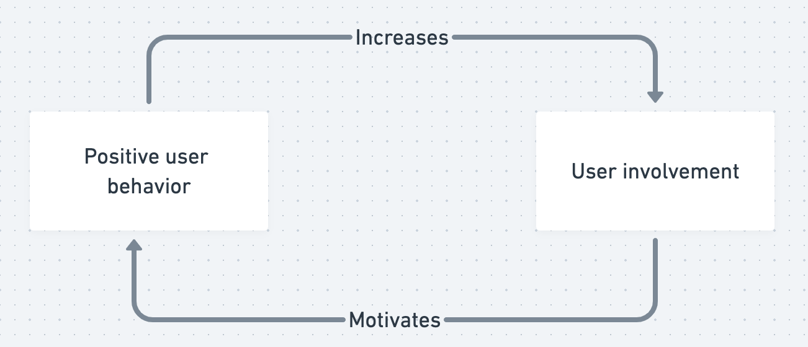

Once we’ve set the behaviors involved in enhancing [[User Involvement]] in motion, we create a virtuous cycle of involvement.  User behavior turns into goal accomplishment. This reinforces the value of those user behaviors, so the user is more likely to use your product when they have a goal that the product can help them accomplish. 

People internalize the value of the app more deeply over time, so [[Designing for user involvement has positive effects on conversion, retention, and virality]].

