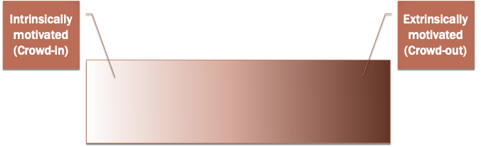

Frey, B.S. and Jegen, R. (2001), Motivation Crowding Theory. Journal of Economic Surveys, 15: 589-611. doi:10.1111/1467-6419.00150

The Relative Price Effect says that if Good A becomes more attractive relative to Good B, then more of Good A and less of Good B should be consumevird. **Motivation Crowding Theory** refers to any time people behave opposite to the predictions of the Relative Price Effect.

According to MCT, Motivation exists on a spectrum.

People move along the spectrum because of:
* Change in preferences
	* External intervention changes their internal motivation (IM)
* Change in perceived situation
	* External intervention changes the personal category of IM
